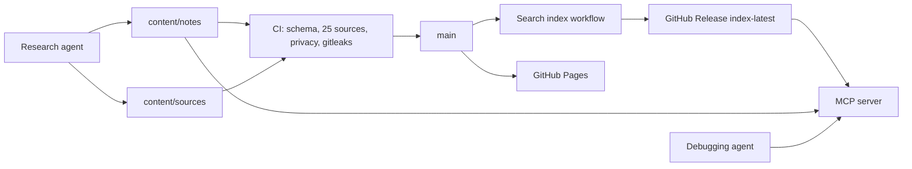

# priorart

[](https://github.com/fvegiard/priorart/actions/workflows/ci.yml)

PriorArt is a public, semantically searchable knowledge base of verified fixes for software and dev-environment problems. A research pass writes one fix note and a raw source pack. Coding agents then query an MCP server, take the recipe, and apply it in one attempt.

No paid API and no repository secret is required for search, validation, or the MCP server.

## Architecture



Notes are markdown with YAML frontmatter. Each note has a JSON source pack that can hold 25 or more references. Real notes must have at least 25. The sample note is marked `example: true` and is left out of the published index and the monthly refresh queue.

On every push to `main`, GitHub Actions embeds the notes with [FastEmbed](https://github.com/qdrant/fastembed) (`BAAI/bge-small-en-v1.5`, local ONNX, no API key) and publishes a hybrid index: cosine similarity fused with BM25 by reciprocal rank fusion.

## Where the index is published

| What | URL |
| --- | --- |
| Moving index | https://github.com/fvegiard/priorart/releases/download/index-latest/priorart-index.json |
| Moving manifest | https://github.com/fvegiard/priorart/releases/download/index-latest/priorart-index-manifest.json |
| Immutable snapshot | `https://github.com/fvegiard/priorart/releases/download/index-<git-sha>/priorart-index.json` |
| Note browser | https://fvegiard.github.io/priorart/ |

`index-latest` is a prerelease whose assets are replaced on each `main` build. `index-<git-sha>` is immutable. The manifest records the git SHA, model, note ids, and the SHA-256 of the index file. The MCP server fetches the moving URL, then builds from `content/notes` if that download fails.

## Run the MCP server locally

Install [uv](https://docs.astral.sh/uv/), then from this repository:

```bash
uv sync --all-groups
uv run priorart serve
```

`priorart serve` speaks MCP over **stdio** on stdin/stdout. Logs go to stderr.

Cursor, project `.cursor/mcp.json` or global `~/.cursor/mcp.json` ([Cursor MCP config](https://cursor.com/docs/context/mcp)):

```json
{
  "mcpServers": {
    "priorart": {
      "type": "stdio",
      "command": "uv",
      "args": [
        "run",
        "--directory",
        "${workspaceFolder}",
        "priorart",
        "serve"
      ]
    }
  }
}
```

`${workspaceFolder}` is the priorart checkout when that checkout is the Cursor project. Otherwise put the absolute path in `--directory`.

The server loads the published index first (`PRIORART_SOURCE=auto`). Until the first `main` release exists, or when you want the working tree, force the local notes:

```json
"env": {
  "PRIORART_SOURCE": "local",
  "PRIORART_INCLUDE_EXAMPLES": "1"
}
```

`PRIORART_INCLUDE_EXAMPLES=1` is only for the fictional sample. Leave it unset for real debugging.

Other MCP clients use the same stdio command. The process entry `priorart-mcp` is the same server with stdio as the default (`PRIORART_TRANSPORT=http` switches it).

### Streamable HTTP

```bash
uv run priorart serve --transport http --host 127.0.0.1 --port 8000
```

The endpoint is `http://127.0.0.1:8000/mcp` (stateless, JSON responses). Cursor:

```json
{
  "mcpServers": {
    "priorart": {
      "url": "http://127.0.0.1:8000/mcp"
    }
  }
}
```

Any client that speaks streamable HTTP can use that URL. Environment variables for the server process:

| Variable | Default | Role |
| --- | --- | --- |
| `PRIORART_SOURCE` | `auto` | `auto` fetches the release, then builds locally. `remote` or `local` pick one |
| `PRIORART_INDEX_URL` | the `index-latest` asset above | Override the index URL |
| `PRIORART_NOTES_DIR` | `content/notes` in this repo | Local notes, used when building locally |
| `PRIORART_INCLUDE_EXAMPLES` | unset | Set to `1` to index `example: true` notes |
| `PRIORART_EMBEDDER` | `fastembed` | `fastembed` or `hash` for a local build. `hash` is an offline test embedder |
| `FASTEMBED_CACHE_PATH` | FastEmbed's own cache | Where the ONNX model is stored |
| `PRIORART_HOST` / `PRIORART_PORT` | `127.0.0.1` / `8000` | Used by `priorart-mcp` when `PRIORART_TRANSPORT=http` |

### Tools

| Tool | Purpose |
| --- | --- |
| `search_fixes` | `query`, `top_k`, optional `tag` and `platform`. Returns the recipe and cited sources |
| `get_fix` | One note by id, including the full source pack |
| `list_topics` | Tags and platforms with counts |
| `list_refresh_due` | Real notes whose `refresh_due` is on or before a date |

## Try the sample

The only note in the tree is an example, so the default index ignores it.

```bash
uv run priorart search "sourceFileMap debugger" --include-examples --embedder hash --expect-id example-windows-debugger-path
```

`--embedder hash` is instant and lexical. Omit it to download `BAAI/bge-small-en-v1.5` and run hybrid search:

```bash
uv run priorart search "sourceFileMap debugger" --include-examples --expect-id example-windows-debugger-path
```

`uv run priorart validate` and `uv run priorart privacy` check the tree the same way CI does.

## Repository layout

```
content/notes/          fix notes and _template.md
content/sources/        source packs and _template.json
schema/                 JSON Schema generated from the pydantic models
src/priorart/           loader, privacy gate, index, MCP server
.github/workflows/      CI, index publish, Pages, CodeQL, monthly refresh, labels
.gitleaks.toml          default secret rules plus path, email, and hostname rules
```

The research workflow, including the 25-source minimum, the 92-day community rule, and commit messages, is [AGENTS.md](AGENTS.md). Day-to-day commands are in [CONTRIBUTING.md](CONTRIBUTING.md).

## GitHub features that need a click

Workflows cannot turn these on by themselves:

- **Pages.** Settings → Pages → Build and deployment → Source: **GitHub Actions**. `.github/workflows/pages.yml` then publishes the note browser.
- **Discussions.** Settings → General → Features → **Discussions**. The template in `.github/DISCUSSION_TEMPLATE/` applies after that. Research requests stay as issues (`.github/ISSUE_TEMPLATE/research_request.yml`). Outcome reports use `fix_outcome.yml`.

Releases and issue labels are created by the workflows. Labels live in `.github/labels.yml`. The monthly job `.github/workflows/refresh.yml` opens or updates one `research-bot` issue per note whose refresh is due.

## Privacy

This is a public repository. CI rejects personal profile paths, non-example email addresses, tokens, internal hostnames, and UNC paths, using gitleaks plus `priorart privacy`. Recipes must use environment variables or the `<USER>` placeholder. See [AGENTS.md](AGENTS.md).

## License

MIT. See [LICENSE](LICENSE).
